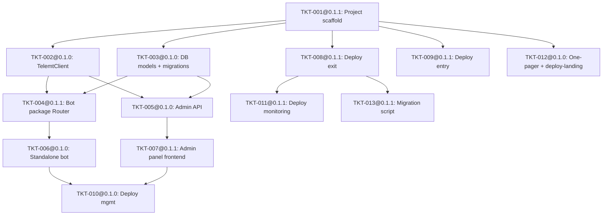

# ARCH-001: Telemt MTProxy Management Layer

## §0 Recon Report

> Written BEFORE design. All files in `docs/knowledge/` read and evaluated.

- **Knowledge consulted:**
  - `docs/knowledge/TELEMT_DEEP_GAPS_VERIFICATION_REPORT.md` — code-level security audit of telemt 3.4.22, TSPU/DPI deep dive, double-hop engineering validation, MTProxyMax code review, scale testing, legal risk, bot architecture, config distribution.
  - `docs/knowledge/TELEMT_DEPLOYMENT_SECURITY_MONITORING_REPORT.md` — full telemt code structure, security audit (API, crypto, Docker, systemd), double-hop configs, panel comparison, ad_tag mechanism, monitoring stack, deploy scenarios, production runbooks.
  - `docs/knowledge/TELEMT_FAKETLS_DOMAIN_SELECTION_REPORT.md` — FakeTLS domain selection for DPI evasion, TSPU threat model (7 detection vectors), ASN mismatch analysis, double-hop architecture analysis, rotation strategy, domain recommendations.
  - `docs/knowledge/TELEMT_GITHUB_ECOSYSTEM_CATALOG.md` — 100+ projects across 15 categories: server implementations, panels, bots, client libraries, DPI tools, monitoring, billing, installers, proxy chains, secrets management, forks.
  - `docs/knowledge/TELEMT_TSPU_EVASION_PATTERNS.md` — production-proven TSPU evasion patterns for double-hop: Russian Reality SNI, PROXYv1, encrypted S2, Angie SNI routing, RU datacenter selection, XHTTP paths. Field-validated July 2026.
  - `docs/knowledge/TELEMT_FAKETLS_DOMAIN_RESEARCH_2026.md` — path-dependent TSPU evasion strategy (S1/S2/S3 segments), top-10 Reality SNI candidates with production validation, self-steal domain implementation guide, PROXY protocol decision matrix, encrypted S2 architecture with full Xray configs, TSPU detection evolution (April + June 2026 waves, Siberian behavioral module), telemt 3.4.22 feature compatibility, operational runbook.

- **Reuse / fork candidates evaluated:**

  | Candidate                                 | Type               | Verdict            | Rationale                                                                                                                                                                                                          |
  | ----------------------------------------- | ------------------ | ------------------ | ------------------------------------------------------------------------------------------------------------------------------------------------------------------------------------------------------------------ |
  | **telemt/telemt 3.4.22**                  | Proxy engine       | **Adopt**          | Only production-ready MTProxy for Russia 2026. REST API, Prometheus, FakeTLS, PROXYv2.                                                                                                                             |
  | **SamNet-dev/MTProxyMax**                 | Bash wrapper       | **Reference only** | 15,486-line monolithic bash script. Valuable patterns (hot-reload via SIGHUP, voucher system, bot commands), but not embeddable as a library. Our architecture requires a Python pip package, not a bash monolith. |
  | **amirotin/telemt_panel**                 | Go+React panel     | **Reference only** | Go backend — we need Python (FastAPI). UI patterns worth studying but cannot reuse directly.                                                                                                                       |
  | **danielVNru/mtproto-panel**              | React+Express+PG   | **Reference only** | Express backend, not FastAPI. Multi-node design interesting for future scaling. React frontend patterns may inform our panel.                                                                                      |
  | **tools/telemt_api.py** (telemt repo)     | Python CLI client  | **Reference**      | 20+ command CLI. Good API endpoint reference, but not a proper SDK. We build `TelemtClient` inspired by this.                                                                                                      |
  | **Grafana Dashboard #25119**              | Dashboard          | **Adopt**          | Verified compatible with telemt 3.4.22. Direct import via ID.                                                                                                                                                      |
  | **telemt grafana-dashboard-by-user.json** | Dashboard          | **Adopt**          | 9-panel per-user dashboard from telemt repo.                                                                                                                                                                       |
  | **spyrae/ProxyCraft**                     | Payment bot        | **Reference only** | Uses mtprotoproxy backend (NOT telemt). Payment gateway patterns (YooKassa, CryptoPay) useful for future tier implementation.                                                                                      |
  | **telemt/tdlib-obf**                      | Client obfuscation | **Out of scope**   | PRD Non-Goal: no custom client builds in MVP.                                                                                                                                                                      |

- **Decision:** **Build from scratch** using telemt as the proxy engine (adopt) and Grafana dashboards (adopt). All management-layer code (bot package, API, admin panel, deploy scripts) is new. No existing project provides the combination of: embeddable pip package + FastAPI admin API + React panel + 4-target IaC deploy — which is exactly the gap this project fills.

## §1 Overview

This spec designs a management layer for the telemt MTProxy server, consisting of seven components: (C1) an embeddable Python package that exposes an aiogram Router for proxy-link distribution, (C2) a standalone Telegram bot reference implementation, (C3) a FastAPI admin API with JWT auth, (C4) a React+TypeScript admin web panel, (C5) infrastructure-as-code with five independent deploy scripts, (C6) a static one-pager landing page, and (C7) an Xray exit relay for encrypted entry-to-exit segment via VLESS-Reality. The architecture targets four independent deploy targets (entry server, exit server, management server, monitoring server) plus a standalone one-pager on any server. telemt 3.4.22 is treated as an external service accessed via its REST API (:9091); this project does not modify or fork telemt.

## §2 Goal Coverage

| PRD Goal                                    | Covered by Component(s)                            |
| ------------------------------------------- | -------------------------------------------------- |
| G1 — User obtains proxy link via bot        | C1 (telemt_proxy package), C2 (standalone bot)     |
| G2 — Operator deploys double-hop proxy      | C5 (deploy scripts: entry, exit, mgmt, monitoring) |
| G3 — Operator creates/tracks labelled links | C3 (admin API), C4 (admin panel)                   |
| G4 — Links survive migration                | C5 (migrate.sh), C1 (domain-based links)           |
| G5 — Operator monitors from Grafana         | C5 (deploy-monitoring.sh), C4 (Grafana embed/link) |
| G6 — Bot embeds in existing bots via pip    | C1 (telemt_proxy pip package with Router)          |
| G7 — Users see promoted channel via ad_tag  | C5 (deploy-exit.sh configures ad_tag)              |

## §3 Components

### C1 — telemt_proxy (embeddable Python package)

- **Responsibility:** Provide an aiogram 3.x `Router` that handles the "Get Proxy" user flow: receives a callback/command, creates a telemt user via the API, constructs a `tg://proxy` link, generates a QR code image for the link, and sends both the link and QR code to the user. Also exposes `TelemtClient` — a typed async httpx wrapper for the telemt REST API — for use by C2 and C3.
- **Interface / contract:**
  - `telemt_proxy.router.create_router(telemt_client, db_session_factory, config, tier_service=None) -> aiogram.Router` — returns a configured Router. The optional `tier_service` parameter is the R18 extension point for future user-tier routing (not implemented in MVP; defaults to `None`). The `config` parameter is a `ProxyConfig` instance containing `server` (entry server FQDN), `port`, and `salt` (for hashing) needed to build proxy links and QR codes.
  - `telemt_proxy.config.ProxyConfig` — dataclass with `server: str` (entry server FQDN), `port: int`, `salt: str` (for hashing), `auth_header: str` (telemt API auth), `base_url: str` (telemt API URL). Loaded from env vars in standalone bot, constructed by host bot for embed case.
  - `telemt_proxy.client.TelemtClient(base_url, auth_header, timeout)` — async context manager; methods: `create_user(username)`, `list_users()`, `get_user(username)`, `disable_user(username)`, `enable_user(username)`, `rotate_secret(username)`, `get_stats_summary()`, `get_active_ips()`, `get_connections_summary()`.
  - `telemt_proxy.models` — SQLAlchemy 2.x async ORM models: `ProxyUser`, `LabelledLink`.
  - `telemt_proxy.link.build_proxy_link(server, port, secret) -> str` — constructs `tg://proxy?server=...&port=...&secret=...`.
  - `telemt_proxy.qr.generate_qr(link: str) -> bytes` — generates a PNG QR code image for the given proxy link.
  - `telemt_proxy.hashing.hash_telegram_id(telegram_id, salt) -> str` — returns `sha256(str(telegram_id) + salt)[:16]`.
  - Error modes: `TelemtAPIError` (base), `TelemtConnectionError`, `TelemtAuthError`, `TelemtNotFoundError`.
- **Depends on:** telemt API (:9091, external), PostgreSQL (via SQLAlchemy async), httpx, aiogram 3.x, qrcode[pil].
- **Relevant ADRs:** ADR-001@0.1.2 (embeddable package architecture), ADR-004@0.1.1 (telemt client wrapper), ADR-005@0.1.0 (user ID hashing), ADR-006@0.1.0 (database access pattern).

### C2 — Standalone Bot (reference implementation)

- **Responsibility:** A runnable Telegram bot (`bot/main.py`) that demonstrates C1 integration. Imports the Router from C1, sets up the Dispatcher, and runs with long polling. Serves as both the operator's production bot and a code example for embedding into other bots.
- **Interface / contract:**
  - Entry point: `python -m bot` or `bot/main.py`.
  - Config via env vars: `BOT_TOKEN`, `TELEMT_API_URL`, `TELEMT_AUTH_HEADER`, `TELEMT_PROXY_SERVER` (entry server FQDN), `TELEMT_PROXY_PORT`, `HASHING_SALT`, `DATABASE_URL`.
  - Integration example:
    ```python
    from telemt_proxy.router import create_router
    from telemt_proxy.config import ProxyConfig
    config = ProxyConfig(server="proxy.example.com", port=443, salt=os.environ["HASHING_SALT"])
    router = create_router(telemt_client, db_session_factory, config)
    dp.include_router(router)
    ```
    M3 measures lines to integrate the router into an existing bot that already has `telemt_client` and `db_session_factory` set up. The `config` construction (2 lines) is deployment configuration, not integration. Core integration remains 3 lines: import, create_router, include_router.
  - Error modes: exits with code 1 on missing env vars, logs connection errors.
- **Depends on:** C1 (telemt_proxy package).
- **Relevant ADRs:** ADR-001@0.1.2.

### C3 — Admin API (FastAPI backend)

- **Responsibility:** Provide admin-only REST endpoints for: user management (list, disable, enable), labelled link CRUD, aggregate stats, per-label stats. Authenticated via JWT (login/password). Proxies telemt API calls through C1's `TelemtClient` and enriches them with local PostgreSQL data (labels, admin users).
- **Interface / contract:**
  - `POST /api/auth/login` — accepts `{username, password}`, returns `{access_token, token_type}`.
  - `GET /api/users` — list all proxy users (telemt data + local labels). Paginated.
  - `POST /api/users/{username}/disable` — disable user in telemt.
  - `POST /api/users/{username}/enable` — enable user in telemt.
  - `GET /api/links` — list all labelled links.
  - `POST /api/links` — create labelled link `{label}`, creates telemt user, stores in DB.
  - `DELETE /api/links/{id}` — delete labelled link (disables telemt user).
  - `GET /api/stats` — aggregate stats (active users, connections, traffic).
  - `GET /api/stats/labels` — per-label stats (connections, traffic per label).
  - `GET /api/health` — health check.
  - All endpoints except `/api/auth/login` and `/api/health` require `Authorization: Bearer <JWT>`.
  - Error modes: 401 (invalid/expired token), 403 (insufficient permissions), 502 (telemt API unreachable), 422 (validation error).
- **Depends on:** C1 (TelemtClient, ORM models), PostgreSQL, python-jose (JWT), passlib (password hashing).
- **Relevant ADRs:** ADR-002@0.1.0 (JWT auth), ADR-006@0.1.0 (database access).

### C4 — Admin Web Panel (React + TypeScript frontend)

- **Responsibility:** Provide a web UI for the operator to manage proxy users, create/track labelled links, view aggregate stats, and access Grafana dashboards. Consumes C3's REST API.
- **Interface / contract:**
  - SPA served by Angie on management server (or any server with deploy-mgmt.sh).
  - Pages: Login, Dashboard (stats overview + Grafana iframe/link), Users (list, search, disable/enable), Links (create, list, copy link, delete), Settings.
  - Auth: JWT stored in httpOnly cookie or localStorage, auto-refresh.
  - Design system: follows Remnawave's visual patterns (dark theme, sidebar nav, card-based layout) per R5.
  - Error modes: shows toast notifications on API errors, redirect to login on 401.
- **Depends on:** C3 (admin API). No direct dependency on C1 or telemt.
- **Relevant ADRs:** ADR-002@0.1.0 (JWT auth).

### C5 — Infrastructure-as-Code (deploy scripts + Docker Compose)

- **Responsibility:** Provide five independent deploy scripts, each deployable on a fresh Ubuntu/Debian server, plus Docker Compose files for each target. Also provides a migration script.
- **Interface / contract:**
  - `infra/entry/deploy-entry.sh` — Xray dokodemo-door + VLESS-Reality outbound on Russia entry server. Prompts for: exit server IP, exit VLESS UUID, exit Reality public key, exit Reality SNI, exit short ID. Entry server has no Reality keys of its own — it is a transparent TCP forwarder with PROXYv1 injection. Produces: Docker Compose + Xray config.
  - `infra/exit/deploy-exit.sh` — Telemt + Angie mask host on EU exit server. Prompts for: domain, ad_tag, tls_domain (recommendations: `github.com`, `www.microsoft.com`), telemt secret (auto-generates if not provided), mask host config. Generates `config.toml` with ad_tag in `[general]` section and `use_middle_proxy = true` (required for ad_tag promotion). Produces: Docker Compose + telemt config.toml + Angie config. Outputs post-deploy message prompting operator to verify ad_tag promotion at @MTProxybot /myproxies.
  - `infra/mgmt/deploy-mgmt.sh` — Management stack on management server. Prompts for: telemt API URL + auth_header, bot token, database URL (or auto-creates PostgreSQL), panel domain, admin username + password (for JWT auth). Produces: Docker Compose + .env.
  - `infra/monitoring/deploy-monitoring.sh` — Prometheus + Grafana on monitoring server. Prompts for: telemt metrics endpoint (exit server :9090), Grafana admin password. Produces: Docker Compose + Prometheus config + Grafana provisioning.
  - `infra/landing/deploy-landing.sh` — One-pager landing page on any server. Prompts for: bot URL (t.me/botname), domain (optional, for HTTPS). Produces: Angie config + static HTML.
  - `scripts/migrate.sh` — Migration script. Stops containers, tars config/state, transfers to new server, deploys, updates Cloudflare DNS A-record via API. Target: < 2 min downtime.
  - All scripts are idempotent. `.env.example` documents all variables.
  - Docker Compose files: `infra/entry/docker-compose.yml`, `infra/exit/docker-compose.yml`, `infra/mgmt/docker-compose.yml`, `infra/monitoring/docker-compose.yml`, `infra/landing/docker-compose.yml`.
- **Depends on:** Docker, Xray (for entry), telemt Docker image (for exit), PostgreSQL Docker image (for mgmt), Prometheus + Grafana Docker images (for monitoring), Angie Docker image (for exit, mgmt, landing).
- **Relevant ADRs:** ADR-003@0.1.1 (deploy script structure), ADR-007@0.1.0 (one-pager as standalone deploy).

### C6 — One-Pager Landing Page (static HTML)

- **Responsibility:** A single static HTML page with a "Получить прокси" (Get Proxy) button that redirects to the standalone bot (t.me link). Served by Angie. Deployable on any server via `deploy-landing.sh`.
- **Interface / contract:**
  - Single `index.html` file with inline CSS. No JavaScript required (pure redirect link).
  - Bot URL configurable via deploy script.
  - Responsive, works on mobile.
- **Depends on:** Angie (for serving). No backend dependency.
- **Relevant ADRs:** ADR-007@0.1.0.

### C7 — Xray Exit Relay (encrypted S2 termination)

- **Responsibility:** Terminate the encrypted VLESS-Reality tunnel from the entry server on :443 and forward decrypted traffic to telemt on localhost:8443 via a `freedom` outbound. Client IP is preserved: the entry server's `freedom proxyProtocol:1` prepends a PROXYv1 header into the data stream before it enters the VLESS tunnel; the exit inbound has `xver:0` (does NOT add its own PROXY header); `freedom` on exit forwards the stream as-is to telemt; telemt parses the PROXYv1 header with `proxy_protocol = true`.
- **Interface / contract:**
  - Listens on `0.0.0.0:443` (VLESS-Reality inbound, accepts connections from entry server only by UUID authentication)
  - Forwards decrypted traffic to `127.0.0.1:8443` (telemt, internal)
  - Requires: EXIT_VLESS_UUID (shared with entry server), EXIT_REALITY_PRIVATE_KEY, EXIT_REALITY_SNI, EXIT_SHORT_IDS
  - Exit inbound `xver: 0` — critical: do NOT set to 1 (would add a second PROXY header with the entry server's IP, breaking client IP preservation)
  - Error modes: connection refused if telemt is not listening on :8443; Reality handshake failure if UUID/keys mismatch
- **Depends on:** telemt (localhost:8443), Docker (Xray container)
- **Relevant ADRs:** ADR-009@0.2.1

## §4 Data & Interfaces

### Database Schema (PostgreSQL, managed by SQLAlchemy async)

```sql
-- Admin users for JWT auth (C3)
CREATE TABLE admin_users (
    id          SERIAL PRIMARY KEY,
    username    VARCHAR(64) UNIQUE NOT NULL,
    password_hash VARCHAR(256) NOT NULL,
    is_active   BOOLEAN DEFAULT TRUE,
    created_at  TIMESTAMPTZ DEFAULT NOW()
);

-- Proxy users (local mirror of telemt users, enriched with Telegram metadata)
CREATE TABLE proxy_users (
    id              SERIAL PRIMARY KEY,
    telemt_username  VARCHAR(16) UNIQUE NOT NULL,  -- sha256(tg_id + salt)[:16]
    telegram_id_hash VARCHAR(64) NOT NULL,          -- full sha256 for dedup
    created_at      TIMESTAMPTZ DEFAULT NOW(),
    is_active       BOOLEAN DEFAULT TRUE,
    source          VARCHAR(32) DEFAULT 'bot'       -- 'bot' | 'admin_label' | 'api'
);

-- Labelled links for tracking (C3, C4)
CREATE TABLE labelled_links (
    id              SERIAL PRIMARY KEY,
    label           VARCHAR(128) UNIQUE NOT NULL,   -- e.g. "forum-4pda"
    telemt_username  VARCHAR(16) NOT NULL REFERENCES proxy_users(telemt_username),
    proxy_link      TEXT NOT NULL,                  -- full tg://proxy?... link
    created_at      TIMESTAMPTZ DEFAULT NOW(),
    is_active       BOOLEAN DEFAULT TRUE
);
```

### Telemt API Contract (external, :9091)

Referenced endpoints (telemt 3.4.22):

| Method | Path                              | Purpose           | Notes                                                 |
| ------ | --------------------------------- | ----------------- | ----------------------------------------------------- |
| POST   | `/v1/users`                       | Create user       | Body: `{"name": "<hash>"}`. Returns user with secret. |
| GET    | `/v1/users`                       | List all users    | Returns array of user objects.                        |
| GET    | `/v1/users/{name}`                | Get single user   | 404 if not found.                                     |
| PATCH  | `/v1/users/{name}`                | Update user       | Body: partial user object.                            |
| POST   | `/v1/users/{name}/disable`        | Disable user      | No body.                                              |
| POST   | `/v1/users/{name}/enable`         | Enable user       | No body.                                              |
| POST   | `/v1/users/{name}/rotate-secret`  | Rotate secret     | Returns new secret. Invalidates existing link.        |
| GET    | `/v1/stats/summary`               | Aggregate stats   | Active users, connections, traffic.                   |
| GET    | `/v1/stats/users/active-ips`      | Per-user IP count | For sharing detection.                                |
| GET    | `/v1/runtime/connections/summary` | Live connections  | Per-user connection count.                            |

All requests require `Authorization: <auth_header>` header. All responses are JSON. Auth uses constant-time comparison. Whitelist checked before auth.

### Internal API Contract (C3 FastAPI, :8000)

See C3 interface in §3. JSON request/response. JWT Bearer auth. CORS configured for admin panel origin.

### Extension Point for User Tiers (R18)

The `proxy_users.source` field and the `TelemtClient` are designed to allow a future
`TierService` to be injected between the Router and the telemt API. The tier service would:

1. Check user tier (Bedolaga Web API lookup by Telegram ID).
2. Apply per-user ad_tag (telemt's `user_ad_tags` config — premium users get `"00000000000000000000000000000000"` for no ad).
3. Apply per-user quota limits.

`create_router()` accepts an optional `tier_service=None` parameter as the documented extension
point for this future capability. When `tier_service` is `None` (the default), all users receive
the same ad_tag configured at the server level.

This is NOT implemented in MVP — only the extension point (clean interface boundary in
`TelemtClient` and the `tier_service` parameter in `create_router()`) exists.

## §5 Cross-cutting Invariants

These apply to ALL components and ALL tickets. The Mentor syncs them into `project.jsonc.invariants`.

1. **INV-AUTH** — All telemt API calls must include the `auth_header` token. Never expose :9091 without authentication.
2. **INV-SECRETS** — All secrets via env vars only. `.env.example` documents names. `.env` is gitignored. Never commit secrets.
3. **INV-HASH** — User identifiers in telemt are `sha256(str(telegram_id) + salt)[:16]` — never raw Telegram IDs. The `hashing.hash_telegram_id()` function is the ONLY place this computation happens.
4. **INV-DOMAIN** — Proxy links must use domain names (never raw IPs) so links survive server migration. The `server=` field in `tg://proxy` links contains the entry server FQDN.
5. **INV-TIMEOUT** — All HTTP clients (httpx) must have explicit timeouts — no infinite waits. Default: 10s connect, 30s read.
6. **INV-ORM** — Database access via SQLAlchemy ORM with parameterised queries only — no raw SQL strings.
7. **INV-EMBED** — The `telemt_proxy` package must be importable as a standalone pip package AND as an aiogram Router include in any existing bot. No global state, no singleton patterns, no module-level side effects.
8. **INV-IDEMPOTENT** — Deploy scripts must be idempotent and interactive — asking for domain, ad_tag, and secrets on first run, skipping prompts on re-run if config exists.
9. **INV-DOCKER** — All Docker containers run with `cap_drop: [ALL]`, `read_only: true` where possible, `security_opt: [no-new-privileges:true]`. telemt adds `cap_add: [NET_BIND_SERVICE]`.
10. **INV-ASYNC** — All I/O operations (HTTP, database, file) must be async. No blocking calls in the event loop.

## §6 Sequencing

### Dependency Graph



### Parallel Execution Clusters

**Wave 1** (no dependencies):

- TKT-001@0.1.1: Project scaffold

**Wave 2** (depends on TKT-001@0.1.1 only, disjoint outputs):

- TKT-002@0.1.0: TelemtClient — outputs: `telemt_proxy/client.py`, `telemt_proxy/exceptions.py`, `tests/test_client.py`
- TKT-003@0.1.0: DB models — outputs: `telemt_proxy/models.py`, `telemt_proxy/database.py`, `alembic/`, `tests/test_models.py`
- TKT-008@0.1.1: Deploy exit — outputs: `infra/exit/**`
- TKT-009@0.1.1: Deploy entry — outputs: `infra/entry/**`
- TKT-012@0.1.0: One-pager + deploy-landing — outputs: `infra/landing/**`

**Wave 3** (depends on TKT-002@0.1.0 + TKT-003@0.1.0, disjoint outputs):

- TKT-004@0.1.1: Bot package Router — outputs: `telemt_proxy/router.py`, `telemt_proxy/hashing.py`, `telemt_proxy/link.py`, `telemt_proxy/qr.py`, `tests/test_router.py`, `tests/test_hashing.py`, `tests/test_link.py`, `tests/test_qr.py`
- TKT-005@0.1.0: Admin API — outputs: `api/**`, `tests/test_api_*.py`

**Wave 4** (disjoint outputs):

- TKT-006@0.1.0: Standalone bot — outputs: `bot/**`, `tests/test_bot.py`
- TKT-007@0.1.1: Admin panel — outputs: `frontend/src/**`
- TKT-011@0.1.1: Deploy monitoring — outputs: `infra/monitoring/**`

**Wave 5**:

- TKT-010@0.1.0: Deploy mgmt — outputs: `infra/mgmt/**`
- TKT-013@0.1.1: Migration script — outputs: `scripts/migrate.sh`

Concurrency cap = 3 (from `project.jsonc`). Waves 2 and 3 will be capped at 3 parallel executors.

### TSPU Evasion Wave (Wave 6, after PRD-001@0.3.0 initial delivery)

**Wave 6a** (no dependencies on each other, disjoint outputs):

- TKT-014@0.2.0: Russian Reality SNI — outputs: `infra/entry/xray-config.json.template` (inbound), `infra/entry/deploy-entry.sh` (SNI section)
- TKT-016@0.2.0: Angie SNI routing — outputs: `infra/exit/angie-sni-router.conf.template` (new), `README.md` (SNI section)

**Wave 6b** (depends on TKT-014@0.2.0):

- TKT-015@0.2.0: PROXYv1 + port fix — outputs: `infra/entry/xray-config.json.template` (outbound), `infra/exit/config.toml.template` (proxy settings)

**Wave 6c** (depends on TKT-015@0.2.0):

- TKT-018@0.2.0: Encrypted S2 — outputs: `infra/entry/xray-config.json.template` (full replace), `infra/exit/xray-config.json.template` (new), `infra/exit/docker-compose.yml`, `infra/exit/config.toml.template` (port), `infra/entry/deploy-entry.sh` (exit prompts), `infra/exit/deploy-exit.sh` (Xray setup)

**Wave 6d** (depends on TKT-018@0.2.0):

- TKT-017@0.2.0: RU datacenter guidance — outputs: `infra/entry/deploy-entry.sh` (banner text), `README.md` (provider section)
- TKT-019@0.2.0: Self-steal domain — outputs: `infra/exit/deploy-exit.sh` (TLS_DOMAIN), `infra/exit/angie-selsteal.conf.template` (new), `infra/exit/config.toml.template` (mask settings), `README.md` (self-steal section)

## §8 Observability

### M6 Attribution — ad_tag Promotion Tracking

@MTProxybot provides per-proxy promotion stats (impressions, subscriber joins attributed to
ad_tag). The admin panel (C4) should display a "Promotion" card linking to the @MTProxybot
stats URL (t.me/MTProxybot) alongside the telemt user count, for manual correlation of channel
subscriber growth with proxy usage. This is a documentation/UX requirement, not an automated
metric — the operator manually compares @MTProxybot promotion stats with the admin panel's
user/traffic data to assess M6 (channel subscriber growth attributable to ad_tag).

## §9 Security

### Threat Surfaces

| Surface             | Exposure                       | Mitigation                                                                                                         |
| ------------------- | ------------------------------ | ------------------------------------------------------------------------------------------------------------------ |
| telemt API (:9091)  | Mgmt server → exit server      | Firewall (UFW: allow from mgmt IP only) + `auth_header` + `whitelist` in telemt config. Never exposed to internet. |
| Admin API (:8000)   | Admin panel → mgmt server      | JWT auth + HTTPS (Angie reverse proxy with auto-cert). Rate limiting on `/api/auth/login` (5 attempts / minute).   |
| Admin panel (:443)  | Operator browser → mgmt server | Served behind Angie with TLS. CORS restricted to panel domain.                                                     |
| PostgreSQL (:5432)  | Mgmt server internal           | Docker network only (not exposed to host). No external connections.                                                |
| Bot (long-polling)  | Outbound only                  | No inbound ports required. Bot token in env var.                                                                   |
| Prometheus (:9090)  | Monitoring → exit server       | telemt binds to `127.0.0.1:9090` by default. For remote scraping, firewall allows only monitoring server IP.       |
| Grafana (:3000)     | Operator browser → monitoring  | Password-protected. Angie reverse proxy with TLS on monitoring server.                                             |
| One-pager (:80/443) | Public internet                | Static HTML only. No backend, no database, no auth needed. Angie serves it. Optional HTTPS via Let's Encrypt.      |

### Secrets Inventory

All secrets are env vars. `.env.example` documents names with placeholder values.

| Secret                   | Component       | Storage                                      |
| ------------------------ | --------------- | -------------------------------------------- |
| `TELEMT_AUTH_HEADER`     | C1, C2, C3      | Env var on mgmt server                       |
| `BOT_TOKEN`              | C2              | Env var on mgmt server                       |
| `DATABASE_URL`           | C1, C2, C3      | Env var on mgmt server                       |
| `HASHING_SALT`           | C1              | Env var on mgmt server                       |
| `JWT_SECRET_KEY`         | C3              | Env var on mgmt server                       |
| `ADMIN_API_KEY`          | C3              | Env var on mgmt server (initial admin setup) |
| `TELEMT_SECRET`          | C5 (exit)       | Env var on exit server / auto-generated      |
| `AD_TAG`                 | C5 (exit)       | Env var on exit server                       |
| `EXIT_REALITY_PRIVATE_KEY` | C5 (exit)       | Env var on exit server / auto-generated      |
| `CLOUDFLARE_API_TOKEN`   | C5 (migrate)    | Env var on mgmt server                       |
| `GRAFANA_ADMIN_PASSWORD` | C5 (monitoring) | Env var on monitoring server                 |

### AuthZ / Isolation Model

- **End users**: interact with the Telegram bot only. No direct API access. No authentication required — they press a button and get a link.
- **Operator (admin)**: authenticates to admin panel via username/password → JWT. Can manage all users, create labelled links, view stats. Single-role (no RBAC in MVP).
- **Bot → telemt API**: service-to-service auth via `auth_header` (shared secret). Bot runs on mgmt server, connects to exit server :9091.
- **Admin API → telemt API**: same `auth_header` as bot. Same `TelemtClient`.
- **Deploy scripts**: run interactively by the operator with root/sudo on target servers. Secrets prompted interactively and stored in `.env` files (not committed).

## §Revision Log

- 2026-07-02 0.1.0 — initial draft.
- 2026-07-02 0.1.1 — fixes from RV-ARCH-001 (10 findings resolved).
- 2026-07-02 0.1.2 — fix create_router() signature drift (RV-ARCH-001-v2 Medium).
- 2026-07-03 0.2.0 — TSPU evasion improvements: encrypted S2 via VLESS-Reality (ADR-009@0.2.1, C7), Russian Reality SNI (ads.x5.ru), PROXYv1, Angie SNI routing (ADR-008@0.2.0), RU datacenter guidance, self-steal domain strategy (ADR-010@0.2.0). 6 new tickets (TKT-014@0.2.0–TKT-019@0.2.0).
- 2026-07-04 0.2.1 — Emergency fix: corrected entry inbound from `vless` (VLESS-Reality) to `dokodemo-door` (transparent TCP forward). ADR-009@0.2.0 incorrectly placed the VLESS-Reality on the client-facing inbound; the correct architecture has the VLESS tunnel on S2 only (entry outbound → exit inbound). Exit xver changed from 1 to 0. Entry no longer needs its own Reality keys. PROXYv1 injection via freedom proxyProtocol:1. Deploy blocker and code review fixes (TKT-020@0.2.1–TKT-023@0.2.1).
