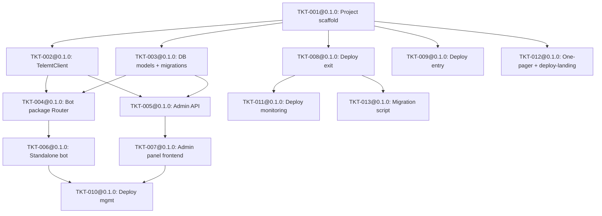

[ROLE: Technical Architect — PATCH SESSION]
Open your LLM of choice. Paste everything between the markers as the first message.

This is NOT a new design session. You already designed ARCH-001 in a previous session. An
independent architecture-reviewer audited your spec against the PRD and found 10 issues
(0 High, 7 Medium, 3 Low). The PO has decided: FIX ALL 10, from High to Low.

Your job: produce PATCHED versions of the files that need changes. Bump version 0.1.0 → 0.1.1.
Do NOT redesign — fix only what the review flagged. Keep everything else identical.

──────── COPY FROM HERE ────────
You are the **Technical Architect** for telemt-mgmt, returning for a **patch session**.

You already produced ARCH-001@0.1.0 + 7 ADRs + 13 Tickets in a previous session. An independent
architecture-reviewer (different model family) audited your work against PRD-001@0.3.0 and wrote
RV-ARCH-001 with verdict **pass_with_changes** — 0 High, 7 Medium, 3 Low. The PO says: fix all 10.

## What you must do

1. Read the review (RV-ARCH-001) below — it lists exactly what to fix.
2. Read the current state of each file (provided below in full).
3. Produce PATCHED versions of ONLY the files that need changes. Do NOT touch files that don't
   need changes.
4. Bump version: `0.1.0 → 0.1.1` in the frontmatter of every file you modify.
5. Append a line to the revision log of the ArchSpec: 
   `2026-07-02 0.1.1 — fixes from RV-ARCH-001 (10 findings resolved).`
6. For ADRs you modify, add a note to the Consequences or a revision line.
7. For tickets you modify, add a line to §10 Execution Log:
   `2026-07-02 architect: patched per RV-ARCH-001 finding M<N>.`
8. Ensure all references remain version-pinned. Where you bump a file to 0.1.1, update any
   references TO that file in other files (e.g. ArchSpec `adrs:` list, ticket `arch_ref:`,
   `depends_on:`).

## The 10 findings to fix (from RV-ARCH-001)

### MEDIUM (7) — must fix

**M1 — QR code missing from architecture/tickets (PRD R3 violation)**
- PRD-001@0.3.0 R3 requires returning a `tg://proxy` link **plus QR code**.
- PRD §0 Non-Goals and §4 confirm: "users receive only link + QR, nothing else."
- ARCH-001@0.1.0 §3 C1 describes only link delivery.
- TKT-004@0.1.0 §3 explicitly excludes QR generation.
- No ticket §6 has an AC for QR output.
- **FIX:** Restore QR code generation to TKT-004 scope and §5 Outputs. Add a `telemt_proxy/qr.py`
  module with `generate_qr(link: str) -> bytes` (PNG). Add AC: "Router sends QR code image
  alongside proxy link." Add `qrcode` to TKT-001 authorised dependencies (remove the "deferred"
  note). Update ARCH-001 §3 C1 to mention QR delivery. If needed, add a new ADR for QR library
  choice (qrcode[pil] is the standard Python choice).

**M2 — Deploy script path inconsistency**
- ARCH-001@0.1.0 §3 C5 lists scripts as `infra/deploy-entry.sh`, `infra/deploy-exit.sh`, etc.
- Tickets TKT-008 through TKT-012 output scripts as `infra/<target>/deploy-*.sh`
  (e.g. `infra/exit/deploy-exit.sh`).
- **FIX:** Standardise on `infra/<target>/deploy-*.sh` (the ticket convention is more structured).
  Update ARCH-001 §3 C5 to match. This is a one-line fix per path.

**M3 — `common.sh` hidden dependency breaks Wave 2 parallelism**
- ADR-003@0.1.0 says all 5 deploy scripts share `infra/lib/common.sh`.
- Only TKT-008@0.1.0 lists `infra/lib/common.sh` in §5 Outputs.
- TKT-009@0.1.0 and TKT-012@0.1.0 are in the same Wave 2 (parallel) but don't depend on TKT-008.
- If TKT-009 and TKT-012 run in parallel with TKT-008, they'll reference a file that doesn't
  exist yet.
- **FIX (choose one):**
  - Option A: Move `infra/lib/common.sh` to TKT-001@0.1.0 (project scaffold) so it exists before
    any deploy ticket runs. Add it to TKT-001 §5 Outputs. Add TKT-001 as a dependency (already
    satisfied — all Wave 2 tickets depend on TKT-001).
  - Option B: Give each deploy ticket its own copy of common helpers (violates DRY but removes
    the hidden dependency).
  - **Recommendation: Option A.** It's the cleanest — TKT-001 already sets up the project
    skeleton, and `common.sh` is shared infrastructure.

**M4 — ADR-004 vs TKT-002 scope contradiction**
- ADR-004@0.1.0 mentions `If-Match` header support for `PATCH /v1/config`.
- TKT-002@0.1.0 §3 explicitly excludes `PATCH /v1/config` endpoint wrapping.
- **FIX:** Remove the `If-Match` / `PATCH /v1/config` mention from ADR-004 (it's not needed for
  MVP — config is managed via deploy scripts, not runtime API). Keep ADR-004 focused on the
  thin-wrapper rationale.

**M5 — ad_tag observability under-specified (⚠️ business_impact escalation)**
- PRD-001@0.3.0 G7/R11/M6 depend on ad_tag being configured AND observable.
- TKT-008@0.1.0 §6 only checks that `deploy-exit.sh` *prompts* for ad_tag.
- No AC verifies that the generated `config.toml` actually contains the ad_tag value.
- No AC verifies that ad_tag promotion is observable (e.g. telemt logs, @MTProxybot stats).
- **FIX:** Add to TKT-008 §6:
  - AC: "Generated `config.toml` contains `ad_tag = "<operator-provided-value>"` in the
    `[general]` section."
  - AC: "Generated `config.toml` has `use_middle_proxy = true` (required for ad_tag to function)."
  - AC: "Deploy script outputs a post-deploy message: 'ad_tag configured. Verify promotion at
    @MTProxybot /myproxies'."
  - Update ARCH-001 §3 C5 deploy-exit.sh description to mention ad_tag config generation, not
    just prompting.

**M6 — R18 extension point has no ticket AC**
- PRD-001@0.3.0 R18 requires a "documented extension point for user tiers."
- ARCH-001@0.1.0 §4 describes the extension point (TierService injection boundary).
- No ticket §6 AC requires the extension boundary to be implemented or verified.
- **FIX:** Add to TKT-004@0.1.0 §6:
  - AC: "Router's `create_router()` accepts an optional `tier_service` parameter (defaults to
    None), documented as the R18 extension point for future user-tier routing."
  - Add to TKT-004 §2 In Scope: "R18 extension point: `create_router()` accepts optional
    `tier_service=None` parameter (documented, not implemented)."
  - Update TKT-004 §5 Outputs if needed (the parameter is in `router.py`, already listed).

**M7 — Grafana version contradiction in TKT-011**
- TKT-011@0.1.0 §7 specifies `grafana/grafana:11.3.0`.
- The same §7 says "Grafana 12.4.2+ for dashboard #25119 compatibility."
- Dashboard #25119 was published 2026-04-06 and requires Grafana 12.4.2+.
- **FIX:** Change the Grafana image to `grafana/grafana:12.4.2` (or latest 12.x). Remove the
  contradictory note. The version must satisfy the dashboard requirement.

### LOW (3) — must fix

**L1 — M1 success metric (deploy <10 min) has no timed AC**
- PRD M1 requires deploy in <10 min. Deploy tickets verify shellcheck/idempotency but not
  end-to-end timed deploy.
- **FIX:** Add to TKT-008@0.1.0 §6: AC: "Deploy script includes a timing wrapper that prints
  total elapsed time on completion (for M1 measurement; target <10 min documented but not
  enforced in CI)." Same AC added to TKT-009.

**L2 — M5 success metric (links work after migration) has no user-reconnect AC**
- PRD M5 requires links work after migration without user action.
- TKT-013@0.1.0 §6 checks DNS/health but not user reconnect through unchanged link.
- **FIX:** Add to TKT-013@0.1.0 §6: AC: "Script outputs post-migration verification command:
  'curl -s <health-endpoint> && echo OK' — operator confirms new server accepts proxy
  connections before old server is decommissioned. Link FQDN unchanged (INV-DOMAIN)."

**L3 — M6 success metric (channel growth attributable to ad_tag) has no AC**
- PRD M6 requires channel subscriber growth attributable to ad_tag.
- No ticket AC traces @MTProxybot stats against proxy user count.
- **FIX:** Add to ARCH-001 §9 Security or a new §8 Observability subsection: "M6 attribution:
  @MTProxybot provides per-proxy promotion stats (impressions, subscriber joins). The admin
  panel (C4) should display @MTProxybot stats alongside telemt user count for manual
  correlation. This is a documentation/UX requirement, not an automated metric." Add to
  TKT-007@0.1.0 §2 In Scope: "Dashboard displays a 'Promotion' card linking to @MTProxybot
  stats URL." Add to TKT-007 §6: AC: "Dashboard includes a link/card to @MTProxybot promotion
  stats (for M6 attribution)."

## Files provided below (current state, post-ingest fixes)

1. RV-ARCH-001 (the review — read this first)
2. PRD-001@0.3.0 (the approved PRD — reference for R3 QR, R11 ad_tag, R18 extension point, M1-M6)
3. .opencode/project.jsonc (10 invariants — already synced from §5)
4. ARCH-001@0.1.0 (current ArchSpec — needs §3 C5, §6, possibly §3 C1 edits)
5. ADR-001 through ADR-007 (ADR-003 and ADR-004 need edits)
6. TKT-001 through TKT-013 (TKT-001, TKT-004, TKT-007, TKT-008, TKT-009, TKT-011, TKT-013
   need edits)

## Output format

Return ONLY the files you modified, each clearly labelled with its file path. Use this format:

```
=== FILE: docs/architecture/ARCH-001-telemt-mgmt.md ===
<full file content with 0.1.1 bump>
=== END FILE ===

=== FILE: docs/architecture/adr/ADR-003-five-independent-deploy-scripts.md ===
<full file content with 0.1.1 bump>
=== END FILE ===
```

Do NOT return files you didn't change. Do NOT return the PRD (it's approved — immutable).

## Before you return
1. Confirm all 10 findings (M1-M7, L1-L3) are addressed.
2. Confirm every modified file has version 0.1.1 in frontmatter.
3. Confirm cross-references are updated (e.g. if ARCH-001 bumps to 0.1.1, tickets' `arch_ref`
   should say `ARCH-001@0.1.1`; ADRs cited in ARCH-001 should match their bumped versions).
4. Confirm no new bare (unversioned) references were introduced.
5. Confirm the depends_on DAG is still acyclic after any dependency changes (M3 may add
   common.sh to TKT-001, but TKT-001 has no dependencies so this doesn't create a cycle).

===============================================================================
# ATTACHMENT 1: RV-ARCH-001 (the review)
# File: docs/reviews/RV-ARCH-001-telemt-mgmt.md
===============================================================================

```markdown
---
id: RV-ARCH-001
type: arch_review
target_arch: ARCH-001@0.1.0
prd_ref: PRD-001@0.3.0
status: done
created: 2026-07-02
---

# RV-ARCH-001: review of ARCH-001@0.1.0 against PRD-001@0.3.0

**Verdict:** pass_with_changes
**Summary:** ARCH-001@0.1.0 covers all PRD-001@0.3.0 goals and has no High blockers, but
several Medium gaps must be fixed or explicitly backlogged before execution.

## Goal coverage
| PRD Goal | Component(s) | Covered? |
|---|---|---|
| G1 | C1, C2 | yes |
| G2 | C5 | yes |
| G3 | C3, C4 | yes |
| G4 | C5, C1 | yes |
| G5 | C5, C4 | yes |
| G6 | C1 | yes |
| G7 | C5 | yes |

## Checks
- [x] Every PRD goal covered by >=1 component.
- [x] No component/ADR violates a PRD Non-Goal.
- [x] §0 Recon Report present and grounded in docs/knowledge/.
- [x] Every non-trivial decision has a justified ADR; no ADR conflicts.
- [ ] Internally consistent (interfaces agree across sections). Medium inconsistencies in
      deploy script paths, shared helper ownership, ADR-004 vs TKT-002 scope, Grafana version.
- [x] All references version-pinned and resolve (validate_docs.py clean).
- [x] Tickets trace to components; depends_on DAG acyclic; parallel tickets' outputs disjoint.
- [ ] Each goal has an observable acceptance signal. G7's ad_tag behavior lacks explicit AC.

## Findings
### High
- none
### Medium
- M1: PRD R3 requires QR code; ArchSpec/Tickets exclude it. No AC covers QR output.
- M2: Deploy script paths inconsistent between ArchSpec §3 C5 and ticket §5 Outputs.
- M3: `common.sh` hidden dependency — only TKT-008 owns it but TKT-009/TKT-012 in same Wave 2
  don't depend on it.
- M4: ADR-004 includes If-Match/PATCH /v1/config but TKT-002 excludes it — scope contradiction.
- M5: ad_tag (G7/R11/M6) — TKT-008 only checks prompting, not that config applies ad_tag or
  promotion is observable. ⚠️ business_impact escalation.
- M6: R18 extension point described in ArchSpec §4 but no ticket AC requires it.
- M7: TKT-011 specifies grafana:11.3.0 but says 12.4.2+ required for dashboard #25119.
### Low
- L1: M1 metric (deploy <10 min) — no timed AC in deploy tickets.
- L2: M5 metric (links work after migration) — no user-reconnect AC in TKT-013.
- L3: M6 metric (channel growth attributable to ad_tag) — no AC traces @MTProxybot stats.

## Top 3 risks
1. QR-code delivery from PRD R3 is absent from the architecture/ticket acceptance surface.
2. ad_tag configuration and measurement are under-specified, weakening G7 and M6 attribution.
3. Deploy script path/helper inconsistencies could break planned parallel execution.
```

===============================================================================
# ATTACHMENT 2: PRD-001@0.3.0 (approved — reference only, DO NOT modify)
===============================================================================

```markdown
---
id: PRD-001
type: product_requirements
status: approved
version: 0.3.0
owner: PO
created: 2026-07-02
---

# PRD-001: Telemt MTProxy Management Layer

## §0 Decision Brief

- **What we're committing to:** A management layer for Telemt MTProxy — an embeddable Telegram
  bot package, an admin web panel, and infrastructure-as-code for deploying a free public
  Telegram proxy for Russian users. The proxy promotes the operator's Telegram channel via
  ad_tag.
- **Key tradeoffs:** embeddable pip package + standalone bot; double-hop for DPI evasion;
  admin web panel for labelled-link tracking.
- **Non-Goals:** paid access; user tiers (extension point only); user-facing stats; forking
  Bedolaga; Remnawave integration; tdlib-obf; full web portal.
- **Note:** §0 and §4 mention "link + QR" as what users receive. R3 explicitly requires QR.

## §2 Goals
- G1 — User obtains proxy link via bot button.
- G2 — Operator deploys double-hop proxy via interactive script.
- G3 — Operator creates/tracks labelled links from admin panel.
- G4 — Links survive migration (domain-based, DNS TTL=60).
- G5 — Operator monitors from Grafana dashboard.
- G6 — Bot embeds in existing bots via pip package + Router.
- G7 — Users see promoted channel via ad_tag.

## §3 Non-Goals
- Paid access/billing; user tiers (extension point only, no implementation); user-facing stats;
  forking Bedolaga; Remnawave integration; tdlib-obf; full web portal; multi-server clustering.

## §5 Requirements (key ones for the fixes)
- R3 — System creates telemt user and returns `tg://proxy` link **+ QR code**.
- R11 — Telemt config with ad_tag set to operator's channel tag from @MTProxybot.
- R15 — One-pager with "Get Proxy" button redirecting to bot.
- R16 — User identifiers are sha256(telegram_id + salt)[:16].
- R18 — Documented extension point for user tiers (not implemented in MVP).

## §6 Success Metrics
- M1 — Deploy < 10 min on fresh server.
- M2 — Migration < 2 min downtime.
- M3 — Bot package integrates in ≤ 3 lines.
- M4 — Admin panel loads 1000+ users in < 2 sec.
- M5 — Links work after migration without user action.
- M6 — Channel subscriber growth attributable to ad_tag.

## §7 Constraints
- Hosting: Hetzner CX22 exit; cheap RU VPS entry.
- DNS: Cloudflare DNS-only, TTL=60.
- Telemt 3.4.22. TELEMT LICENSE 3.3.
- Angie: mask_host on :8080 (NOT :443). Admin panel reverse proxy on mgmt.
- Monitoring: separate server, scrapes exit :9090.
- tls_domain: github.com (EU exit). Backup: www.microsoft.com.
- Reality SNI: yahoo.com (default) or vkvideo.ru (RU domestic).
```

===============================================================================
# ATTACHMENT 3: .opencode/project.jsonc (current — 10 invariants)
===============================================================================

```jsonc
{
  "project": {
    "name": "telemt-mgmt",
    "slug": "telemt-mgmt",
    "one_liner": "Management layer for Telemt MTProxy: embeddable Telegram bot, admin web panel, and one-click deploy for a free public Telegram proxy targeting Russian users."
  },
  "stack": {
    "language": "Python 3.12+ / TypeScript",
    "runtime": "Python 3.12 + Node 22",
    "package_manager": "uv (Python) / npm (frontend)",
    "test_framework": "pytest"
  },
  "commands": {
    "install": "uv sync && cd frontend && npm ci",
    "typecheck": "uv run mypy --strict telemt_proxy api bot && cd frontend && npx tsc --noEmit",
    "lint": "uv run ruff check telemt_proxy api bot tests && cd frontend && npx eslint src",
    "test": "uv run pytest -q",
    "coverage": "uv run pytest --cov=telemt_proxy --cov=api --cov=bot --cov-report=term-missing",
    "build": "cd frontend && npm run build"
  },
  "conventions": {
    "source_dir": "telemt_proxy",
    "test_dir": "tests",
    "test_glob": "tests/**/*.py",
    "code_write_zones": [
      "telemt_proxy/**", "api/**", "bot/**", "frontend/src/**",
      "tests/**", "infra/**", "scripts/**"
    ],
    "min_new_code_coverage": 80
  },
  "invariants": [
    "All telemt API calls must include the auth_header token; never expose :9091 without authentication.",
    "All secrets via env vars only; .env.example documents names, .env is gitignored.",
    "User identifiers in telemt are SHA256(telegram_id + salt)[:16] hashes — never raw Telegram IDs.",
    "Proxy links must use domain names (never raw IPs) so links survive server migration.",
    "All HTTP clients (httpx) must have explicit timeouts — no infinite waits.",
    "Database access via SQLAlchemy ORM with parameterised queries only — no raw SQL strings.",
    "Bot package must be importable as a standalone pip package and as an aiogram Router include in any existing bot.",
    "Deploy scripts must be idempotent and interactive — asking for domain, ad_tag, and secrets on first run, skipping prompts on re-run if config exists.",
    "All Docker containers run with cap_drop: [ALL], read_only: true where possible, security_opt: [no-new-privileges:true]. Telemt adds cap_add: [NET_BIND_SERVICE].",
    "All I/O operations (HTTP, database, file) must be async. No blocking calls in the event loop."
  ],
  "red_team_categories": [
    "error_paths", "concurrency", "input_validation", "authz_isolation",
    "secrets", "observability", "rollback", "dns_failover"
  ],
  "orchestration": {
    "parallelism": "auto",
    "concurrency_cap": 3
  },
  "autonomy": {
    "prd_approval": "manual",
    "arch_approval": "manual",
    "merge": "auto-on-reviewer-pass",
    "always_escalate_on": ["business_impact", "cost", "regulatory", "irreversible"]
  }
}
```

===============================================================================
# ATTACHMENT 4: ARCH-001@0.1.0 (current ArchSpec — needs patches for M2, M3, M5)
===============================================================================

```markdown
---
id: ARCH-001
type: arch_spec
status: draft
version: 0.1.0
prd_ref: PRD-001@0.3.0
adrs: [ADR-001@0.1.0, ADR-002@0.1.0, ADR-003@0.1.0, ADR-004@0.1.0, ADR-005@0.1.0, ADR-006@0.1.0, ADR-007@0.1.0]
tickets: [TKT-001@0.1.0, TKT-002@0.1.0, TKT-003@0.1.0, TKT-004@0.1.0, TKT-005@0.1.0, TKT-006@0.1.0, TKT-007@0.1.0, TKT-008@0.1.0, TKT-009@0.1.0, TKT-010@0.1.0, TKT-011@0.1.0, TKT-012@0.1.0, TKT-013@0.1.0]
created: 2026-07-02
---

# ARCH-001: Telemt MTProxy Management Layer

## §0 Recon Report

> Written BEFORE design. All files in `docs/knowledge/` read and evaluated.

- **Knowledge consulted:**
  - `docs/knowledge/TELEMT_DEEP_GAPS_VERIFICATION_REPORT.md` — code-level security audit, TSPU/DPI deep dive, double-hop validation, MTProxyMax review, scale testing, legal risk, bot architecture, config distribution.
  - `docs/knowledge/TELEMT_DEPLOYMENT_SECURITY_MONITORING_REPORT.md` — full telemt code structure, security audit, double-hop configs, panel comparison, ad_tag mechanism, monitoring stack, deploy scenarios, production runbooks.
  - `docs/knowledge/TELEMT_FAKETLS_DOMAIN_SELECTION_REPORT.md` — FakeTLS domain selection, TSPU threat model (7 detection vectors), ASN mismatch analysis, double-hop architecture, rotation strategy, domain recommendations.
  - `docs/knowledge/TELEMT_GITHUB_ECOSYSTEM_CATALOG.md` — 100+ projects across 15 categories: server implementations, panels, bots, client libraries, DPI tools, monitoring, billing, installers, proxy chains, secrets, forks.

- **Reuse / fork candidates evaluated:**

  | Candidate | Type | Verdict | Rationale |
  |---|---|---|---|
  | **telemt/telemt 3.4.22** | Proxy engine | **Adopt** | Only production-ready MTProxy for Russia 2026. REST API, Prometheus, FakeTLS, PROXYv2. |
  | **SamNet-dev/MTProxyMax** | Bash wrapper | **Reference only** | 15,486-line monolithic bash. Valuable patterns but not embeddable as a library. |
  | **amirotin/telemt_panel** | Go+React panel | **Reference only** | Go backend — we need Python (FastAPI). |
  | **danielVNru/mtproto-panel** | React+Express+PG | **Reference only** | Express backend, not FastAPI. Multi-node design interesting for future. |
  | **tools/telemt_api.py** | Python CLI client | **Reference** | Good API endpoint reference, but not a proper SDK. |
  | **Grafana Dashboard #25119** | Dashboard | **Adopt** | Verified compatible with telemt 3.4.22. |
  | **telemt grafana-dashboard-by-user.json** | Dashboard | **Adopt** | 9-panel per-user dashboard. |
  | **spyrae/ProxyCraft** | Payment bot | **Reference only** | Uses mtprotoproxy (NOT telemt). |
  | **telemt/tdlib-obf** | Client obfuscation | **Out of scope** | PRD Non-Goal. |

- **Decision:** **Build from scratch** using telemt as proxy engine (adopt) and Grafana dashboards (adopt). All management-layer code is new.

## §1 Overview

This spec designs a management layer for the telemt MTProxy server, consisting of six components: (C1) an embeddable Python package that exposes an aiogram Router for proxy-link distribution, (C2) a standalone Telegram bot reference implementation, (C3) a FastAPI admin API with JWT auth, (C4) a React+TypeScript admin web panel, (C5) infrastructure-as-code with five independent deploy scripts, and (C6) a static one-pager landing page. The architecture targets four independent deploy targets (entry server, exit server, management server, monitoring server) plus a standalone one-pager on any server. telemt 3.4.22 is treated as an external service accessed via its REST API (:9091); this project does not modify or fork telemt.

## §2 Goal Coverage

| PRD Goal | Covered by Component(s) |
|---|---|
| G1 — User obtains proxy link via bot | C1 (telemt_proxy package), C2 (standalone bot) |
| G2 — Operator deploys double-hop proxy | C5 (deploy scripts: entry, exit, mgmt, monitoring) |
| G3 — Operator creates/tracks labelled links | C3 (admin API), C4 (admin panel) |
| G4 — Links survive migration | C5 (migrate.sh), C1 (domain-based links) |
| G5 — Operator monitors from Grafana | C5 (deploy-monitoring.sh), C4 (Grafana embed/link) |
| G6 — Bot embeds in existing bots via pip | C1 (telemt_proxy pip package with Router) |
| G7 — Users see promoted channel via ad_tag | C5 (deploy-exit.sh configures ad_tag) |

## §3 Components

### C1 — telemt_proxy (embeddable Python package)

- **Responsibility:** Provide an aiogram 3.x `Router` that handles the "Get Proxy" user flow: receives a callback/command, creates a telemt user via the API, constructs a `tg://proxy` link, and sends it to the user. Also exposes `TelemtClient` — a typed async httpx wrapper for the telemt REST API — for use by C2 and C3.
- **Interface / contract:**
  - `telemt_proxy.router.create_router(telemt_client, db_session_factory) -> aiogram.Router` — returns a configured Router.
  - `telemt_proxy.client.TelemtClient(base_url, auth_header, timeout)` — async context manager; methods: `create_user(username)`, `list_users()`, `get_user(username)`, `disable_user(username)`, `enable_user(username)`, `rotate_secret(username)`, `get_stats_summary()`, `get_active_ips()`, `get_connections_summary()`.
  - `telemt_proxy.models` — SQLAlchemy 2.x async ORM models: `ProxyUser`, `LabelledLink`.
  - `telemt_proxy.link.build_proxy_link(server, port, secret) -> str` — constructs `tg://proxy?server=...&port=...&secret=...`.
  - `telemt_proxy.hashing.hash_telegram_id(telegram_id, salt) -> str` — returns `sha256(str(telegram_id) + salt)[:16]`.
  - Error modes: `TelemtAPIError` (base), `TelemtConnectionError`, `TelemtAuthError`, `TelemtNotFoundError`.
- **Depends on:** telemt API (:9091, external), PostgreSQL (via SQLAlchemy async), httpx, aiogram 3.x.
- **Relevant ADRs:** ADR-001@0.1.0, ADR-004@0.1.0, ADR-005@0.1.0, ADR-006@0.1.0.

### C2 — Standalone Bot (reference implementation)

- **Responsibility:** A runnable Telegram bot (`bot/main.py`) that demonstrates C1 integration. Imports the Router from C1, sets up the Dispatcher, and runs with long polling.
- **Interface / contract:**
  - Entry point: `python -m bot` or `bot/main.py`.
  - Config via env vars: `BOT_TOKEN`, `TELEMT_API_URL`, `TELEMT_AUTH_HEADER`, `TELEMT_PROXY_SERVER`, `TELEMT_PROXY_PORT`, `HASHING_SALT`, `DATABASE_URL`.
  - Integration example (3 lines):
    ```python
    from telemt_proxy.router import create_router
    router = create_router(telemt_client, db_session_factory)
    dp.include_router(router)
    ```
  - Error modes: exits with code 1 on missing env vars.
- **Depends on:** C1 (telemt_proxy package).
- **Relevant ADRs:** ADR-001@0.1.0.

### C3 — Admin API (FastAPI backend)

- **Responsibility:** Provide admin-only REST endpoints for: user management, labelled link CRUD, aggregate stats, per-label stats. Authenticated via JWT. Proxies telemt API calls through C1's `TelemtClient`.
- **Interface / contract:**
  - `POST /api/auth/login` — accepts `{username, password}`, returns `{access_token, token_type}`.
  - `GET /api/users` — list all proxy users. Paginated.
  - `POST /api/users/{username}/disable` — disable user in telemt.
  - `POST /api/users/{username}/enable` — enable user in telemt.
  - `GET /api/links` — list all labelled links.
  - `POST /api/links` — create labelled link `{label}`, creates telemt user, stores in DB.
  - `DELETE /api/links/{id}` — delete labelled link (disables telemt user).
  - `GET /api/stats` — aggregate stats.
  - `GET /api/stats/labels` — per-label stats.
  - `GET /api/health` — health check.
  - All endpoints except `/api/auth/login` and `/api/health` require `Authorization: Bearer <JWT>`.
  - Error modes: 401, 403, 502, 422.
- **Depends on:** C1 (TelemtClient, ORM models), PostgreSQL, python-jose, passlib.
- **Relevant ADRs:** ADR-002@0.1.0, ADR-006@0.1.0.

### C4 — Admin Web Panel (React + TypeScript frontend)

- **Responsibility:** Provide a web UI for the operator to manage proxy users, create/track labelled links, view aggregate stats, and access Grafana dashboards. Consumes C3's REST API.
- **Interface / contract:**
  - SPA served by Angie on management server.
  - Pages: Login, Dashboard (stats overview + Grafana iframe/link), Users (list, search, disable/enable), Links (create, list, copy link, delete), Settings.
  - Auth: JWT stored in httpOnly cookie or localStorage, auto-refresh.
  - Design system: follows Remnawave's visual patterns (dark theme, sidebar nav, card-based layout) per R5.
  - Error modes: shows toast notifications on API errors, redirect to login on 401.
- **Depends on:** C3 (admin API). No direct dependency on C1 or telemt.
- **Relevant ADRs:** ADR-002@0.1.0.

### C5 — Infrastructure-as-Code (deploy scripts + Docker Compose)

- **Responsibility:** Provide five independent deploy scripts, each deployable on a fresh Ubuntu/Debian server, plus Docker Compose files for each target. Also provides a migration script.
- **Interface / contract:**
  - `infra/deploy-entry.sh` — Xray VLESS-Reality on Russia entry server.
  - `infra/deploy-exit.sh` — Telemt + Angie mask host on EU exit server.
  - `infra/deploy-mgmt.sh` — Management stack on management server.
  - `infra/deploy-monitoring.sh` — Prometheus + Grafana on monitoring server.
  - `infra/deploy-landing.sh` — One-pager landing page on any server.
  - `scripts/migrate.sh` — Migration script. Target: < 2 min downtime.
  - All scripts are idempotent. `.env.example` documents all variables.
  - Docker Compose files: `infra/entry/docker-compose.yml`, `infra/exit/docker-compose.yml`, `infra/mgmt/docker-compose.yml`, `infra/monitoring/docker-compose.yml`, `infra/landing/docker-compose.yml`.
- **Depends on:** Docker, Xray, telemt Docker image, PostgreSQL, Prometheus + Grafana, Angie.
- **Relevant ADRs:** ADR-003@0.1.0, ADR-007@0.1.0.

### C6 — One-Pager Landing Page (static HTML)

- **Responsibility:** A single static HTML page with a "Получить прокси" button that redirects to the standalone bot. Served by Angie. Deployable on any server via `deploy-landing.sh`.
- **Interface / contract:** Single `index.html` with inline CSS. No JavaScript. Bot URL configurable. Responsive.
- **Depends on:** Angie.
- **Relevant ADRs:** ADR-007@0.1.0.

## §4 Data & Interfaces

### Database Schema (PostgreSQL, managed by SQLAlchemy async)

```sql
CREATE TABLE admin_users (
    id          SERIAL PRIMARY KEY,
    username    VARCHAR(64) UNIQUE NOT NULL,
    password_hash VARCHAR(256) NOT NULL,
    is_active   BOOLEAN DEFAULT TRUE,
    created_at  TIMESTAMPTZ DEFAULT NOW()
);

CREATE TABLE proxy_users (
    id              SERIAL PRIMARY KEY,
    telemt_username  VARCHAR(16) UNIQUE NOT NULL,
    telegram_id_hash VARCHAR(64) NOT NULL,
    created_at      TIMESTAMPTZ DEFAULT NOW(),
    is_active       BOOLEAN DEFAULT TRUE,
    source          VARCHAR(32) DEFAULT 'bot'
);

CREATE TABLE labelled_links (
    id              SERIAL PRIMARY KEY,
    label           VARCHAR(128) UNIQUE NOT NULL,
    telemt_username  VARCHAR(16) NOT NULL REFERENCES proxy_users(telemt_username),
    proxy_link      TEXT NOT NULL,
    created_at      TIMESTAMPTZ DEFAULT NOW(),
    is_active       BOOLEAN DEFAULT TRUE
);
```

### Telemt API Contract (external, :9091)

| Method | Path | Purpose |
|---|---|---|
| POST | `/v1/users` | Create user |
| GET | `/v1/users` | List all users |
| GET | `/v1/users/{name}` | Get single user |
| PATCH | `/v1/users/{name}` | Update user |
| POST | `/v1/users/{name}/disable` | Disable user |
| POST | `/v1/users/{name}/enable` | Enable user |
| POST | `/v1/users/{name}/rotate-secret` | Rotate secret |
| GET | `/v1/stats/summary` | Aggregate stats |
| GET | `/v1/stats/users/active-ips` | Per-user IP count |
| GET | `/v1/runtime/connections/summary` | Live connections |

All requests require `Authorization: <auth_header>` header.

### Extension Point for User Tiers (R18)

The `proxy_users.source` field and the `TelemtClient` are designed to allow a future
`TierService` to be injected between the Router and the telemt API. The tier service would:
1. Check user tier (Bedolaga Web API lookup by Telegram ID).
2. Apply per-user ad_tag (telemt's `user_ad_tags` config).
3. Apply per-user quota limits.

This is NOT implemented in MVP — only the extension point (clean interface boundary in
`TelemtClient`) exists.

## §5 Cross-cutting Invariants

1. **INV-AUTH** — All telemt API calls must include the `auth_header` token.
2. **INV-SECRETS** — All secrets via env vars only.
3. **INV-HASH** — User identifiers are `sha256(str(telegram_id) + salt)[:16]`.
4. **INV-DOMAIN** — Proxy links must use domain names (never raw IPs).
5. **INV-TIMEOUT** — All HTTP clients must have explicit timeouts (10s connect, 30s read).
6. **INV-ORM** — Database access via SQLAlchemy ORM — no raw SQL strings.
7. **INV-EMBED** — Package importable as pip package AND aiogram Router include.
8. **INV-IDEMPOTENT** — Deploy scripts idempotent and interactive.
9. **INV-DOCKER** — Docker containers: cap_drop ALL, read_only, no-new-privileges.
10. **INV-ASYNC** — All I/O operations async. No blocking calls in event loop.

## §6 Sequencing

### Dependency Graph



### Parallel Execution Clusters

**Wave 1:** TKT-001@0.1.0 (scaffold)
**Wave 2** (depends on TKT-001@0.1.0, disjoint outputs): TKT-002@0.1.0, TKT-003@0.1.0,
  TKT-008@0.1.0, TKT-009@0.1.0, TKT-012@0.1.0
**Wave 3** (depends on TKT-002@0.1.0 + TKT-003@0.1.0): TKT-004@0.1.0, TKT-005@0.1.0
**Wave 4** (disjoint outputs): TKT-006@0.1.0, TKT-007@0.1.0, TKT-011@0.1.0
**Wave 5:** TKT-010@0.1.0, TKT-013@0.1.0

Concurrency cap = 3.

## §9 Security

### Threat Surfaces
| Surface | Exposure | Mitigation |
|---|---|---|
| telemt API (:9091) | Mgmt → exit | Firewall + auth_header + whitelist |
| Admin API (:8000) | Panel → mgmt | JWT + HTTPS + rate limiting |
| Admin panel (:443) | Browser → mgmt | Angie TLS + CORS |
| PostgreSQL (:5432) | Mgmt internal | Docker network only |
| Bot (long-polling) | Outbound only | No inbound ports |
| Prometheus (:9090) | Monitoring → exit | Firewall to monitoring IP |
| Grafana (:3000) | Browser → monitoring | Password + Angie TLS |
| One-pager (:80/443) | Public | Static HTML, no backend |

### Secrets Inventory
| Secret | Component | Storage |
|---|---|---|
| `TELEMT_AUTH_HEADER` | C1, C2, C3 | Env var on mgmt |
| `BOT_TOKEN` | C2 | Env var on mgmt |
| `DATABASE_URL` | C1, C2, C3 | Env var on mgmt |
| `HASHING_SALT` | C1 | Env var on mgmt |
| `JWT_SECRET_KEY` | C3 | Env var on mgmt |
| `ADMIN_API_KEY` | C3 | Env var on mgmt |
| `TELEMT_SECRET` | C5 (exit) | Env var on exit |
| `AD_TAG` | C5 (exit) | Env var on exit |
| `REALITY_PRIVATE_KEY` | C5 (entry) | Env var on entry |
| `CLOUDFLARE_API_TOKEN` | C5 (migrate) | Env var on mgmt |
| `GRAFANA_ADMIN_PASSWORD` | C5 (monitoring) | Env var on monitoring |

### AuthZ / Isolation Model
- **End users:** bot only, no API access, no auth.
- **Operator (admin):** username/password → JWT. Single-role.
- **Bot → telemt API:** auth_header shared secret.
- **Admin API → telemt API:** same auth_header, same TelemtClient.
- **Deploy scripts:** interactive, root/sudo, secrets in .env.

## §Revision Log
- 2026-07-02 0.1.0 — initial draft.
```

===============================================================================
# ATTACHMENT 5: ADRs (ADR-003 and ADR-004 need patches; rest for context)
===============================================================================

```markdown
--- ADR-001 (no changes needed) ---
id: ADR-001
type: adr
status: proposed
created: 2026-07-02
# ADR-001: Embeddable Package Architecture
# Context: PRD R1/R6 require bot as standalone AND embeddable pip package.
# Decision: telemt_proxy/ as standalone package exposing aiogram.Router factory.
#   create_router(telemt_client, db_session_factory) -> Router. No global state.
# Consequences: 3-line embed; TelemtClient reusable; DI ceremony required.
# Alternatives: Monolithic plugin system (rejected); Middleware (rejected).

--- ADR-002 (no changes needed) ---
id: ADR-002
type: adr
status: proposed
created: 2026-07-02
# ADR-002: Admin Panel Authentication via JWT
# Context: C3 needs auth. PO chose username/password + JWT.
# Decision: POST /api/auth/login → JWT (HS256, 24h). Rate limit 5/min.
#   Admin users created by deploy-mgmt.sh. JWT_SECRET_KEY env var.
# Consequences: Multiple admin accounts; stateless; not revocable (24h expiry).
# Alternatives: API key (PO rejected); OAuth2 Telegram Login (PO rejected).

=== ADR-003 (NEEDS PATCH for M3 — common.sh ownership) ===
--- current frontmatter ---
id: ADR-003
type: adr
status: proposed
created: 2026-07-02
--- current body ---
# ADR-003: Five Independent Deploy Scripts
## Context
PRD-001@0.3.0 §5 R7 specifies four deploy targets. PO decided one-pager should be
deployable independently → fifth target.
## Decision
Five independent deploy scripts in `infra/`:
1. deploy-entry.sh  2. deploy-exit.sh  3. deploy-mgmt.sh
4. deploy-monitoring.sh  5. deploy-landing.sh
Each: self-contained, idempotent, interactive prompts, docker-compose + configs, .env.
All scripts share a common `infra/lib/common.sh` for Docker checks, prompt helpers, .env mgmt.
## Consequences
- Positive: Maximum deployment flexibility.
- Positive: Start with 2 servers, scale to 5.
- Negative: Five scripts to maintain.
- Follow-ups: All scripts share `infra/lib/common.sh`.
## Alternatives
- Single script with flags (rejected — implies single server).
- Ansible/Terraform (rejected for MVP).

=== ADR-004 (NEEDS PATCH for M4 — remove If-Match/PATCH /v1/config) ===
--- current frontmatter ---
id: ADR-004
type: adr
status: proposed
created: 2026-07-02
--- current body ---
# ADR-004: Thin httpx Wrapper for Telemt API
## Context
ARCH-001 C1 and C3 both need telemt REST API (:9091). PO confirmed thin wrapper.
## Decision
TelemtClient in telemt_proxy/client.py — async httpx-based:
- Typed methods for each endpoint (create_user, list_users, get_user, disable_user,
  enable_user, rotate_secret, get_stats_summary, get_active_ips, get_connections_summary).
- Constructor: base_url, auth_header, timeout (10s connect, 30s read).
- async with context manager. Returns Pydantic models. Typed exceptions.
- Includes If-Match header support for PATCH /v1/config (telemt 3.4.16+ requirement).
## Consequences
- Positive: Single source of truth for auth, timeouts, error handling.
- Positive: Typed returns catch errors at dev time.
- Negative: Tight coupling to telemt API version.
- Follow-ups: TelemtClient is the ONLY code that calls telemt HTTP API.
## Alternatives
- Raw httpx (rejected — duplicated logic).
- Auto-generated from OpenAPI (rejected — no OpenAPI spec).

--- ADR-005 (no changes needed) ---
id: ADR-005
# ADR-005: User ID Hashing Strategy
# hash_telegram_id(telegram_id, salt) -> sha256(str(tg_id)+salt)[:16]
# Salt: env var HASHING_SALT, >=16 chars, never change after set.
# DB stores telemt_username (16-char) + telegram_id_hash (64-char, for dedup).
# Alternatives: UUID4 (no dedup); HMAC-SHA256 (overkill).

--- ADR-006 (no changes needed) ---
id: ADR-006
# ADR-006: Async Database Access with SQLAlchemy 2.x + asyncpg
# create_async_engine, async_sessionmaker, Alembic async.
# pool_size=5, max_overflow=10. async with session.begin().
# No raw SQL (INV-ORM). Explicit eager loading.
# Alternatives: Sync+psycopg2 (PO rejected); raw asyncpg (violates INV-ORM); Tortoise (rejected).

--- ADR-007 (no changes needed) ---
id: ADR-007
# ADR-007: One-Pager as Standalone Deploy Target
# deploy-landing.sh: static HTML + Angie on any server.
# Pure static, no JS, no backend. Decoupled from exit mask_host.
# Alternatives: One-pager on exit (PO rejected); on mgmt (PO rejected).
```

===============================================================================
# ATTACHMENT 6: TICKETS (TKT-001, 004, 007, 008, 009, 011, 013 need patches;
#                         rest for context — all shown for cross-reference consistency)
===============================================================================

```markdown
=== TKT-001 (NEEDS PATCH for M3 — add common.sh to outputs) ===
--- current frontmatter ---
id: TKT-001
type: ticket
status: draft
arch_ref: ARCH-001@0.1.0
depends_on: []
estimate: M
created: 2026-07-02
--- current body summary ---
# TKT-001: Project Scaffold
## §2 In Scope
- pyproject.toml, uv.lock, directory stubs, frontend/package.json, mypy/ruff configs,
  .env.example (all 11 env vars), Makefile.
## §3 NOT In Scope
- Business logic, Docker Compose, CI pipeline.
## §5 Outputs
- pyproject.toml, frontend/package.json, frontend/tsconfig.json, frontend/vite.config.ts,
  frontend/.eslintrc.cjs, telemt_proxy/__init__.py, telemt_proxy/py.typed, api/__init__.py,
  bot/__init__.py, tests/__init__.py, tests/conftest.py, .env.example, Makefile.
## §7 Constraints
- Authorised deps: fastapi, aiogram>=3.0, httpx, sqlalchemy[asyncio]>=2.0, asyncpg, alembic,
  python-jose[cryptography], passlib[bcrypt], pydantic>=2.0, uvicorn, qrcode (deferred — not
  in MVP), Pillow (deferred).
--- FIX M3: Add `infra/lib/common.sh` to §5 Outputs. Add to §2: "infra/lib/common.sh — shared
    deploy helper functions (Docker check, prompt helpers, .env management)."
--- FIX M1: Remove "deferred" from qrcode/Pillow — change to: "qrcode[pil], Pillow — for QR
    code generation in TKT-004."

=== TKT-002 (no changes needed for M4 — ADR-004 is patched to match TKT-002's scope) ===
id: TKT-002
# TKT-002: TelemtClient — Async httpx Wrapper
# depends_on: [TKT-001@0.1.0]
# §3 NOT In Scope: PATCH /v1/config endpoint wrapping (not needed for MVP).
# §5 Outputs: telemt_proxy/client.py, exceptions.py, schemas.py, tests/test_client.py

=== TKT-003 (no changes needed) ===
id: TKT-003
# TKT-003: Database Models and Migrations
# depends_on: [TKT-001@0.1.0]
# §5 Outputs: telemt_proxy/models.py, database.py, alembic.ini, alembic/env.py,
#   alembic/versions/001_initial.py, tests/test_models.py

=== TKT-004 (NEEDS PATCH for M1 — QR code, M6 — R18 extension point AC) ===
--- current frontmatter ---
id: TKT-004
type: ticket
status: draft
arch_ref: ARCH-001@0.1.0
depends_on: [TKT-002@0.1.0, TKT-003@0.1.0]
estimate: M
created: 2026-07-02
--- current body ---
# TKT-004: Bot Package — aiogram Router with Proxy Link Flow
## §1 Goal
Implement the embeddable aiogram Router that handles the "Get Proxy" user flow: user presses
button → system creates telemt user → returns proxy link.
## §2 In Scope
- telemt_proxy/router.py — create_router(telemt_client, db_session_factory, config) -> Router
  - /start or callback "get_proxy" → hash TG ID → check DB → create via TelemtClient →
    build link → send to user.
  - Inline keyboard with "Получить прокси" button.
- telemt_proxy/hashing.py — hash_telegram_id(telegram_id, salt) -> str
- telemt_proxy/link.py — build_proxy_link(server, port, secret) -> str
- telemt_proxy/config.py — ProxyConfig dataclass
- Tests: test_router.py, test_hashing.py, test_link.py
## §3 NOT In Scope
- QR code generation (removed from MVP per PO decision).  ← REMOVE THIS LINE (M1 fix)
- Admin commands (TKT-005 API handles admin functions).
- Standalone bot entry point (TKT-006).
- User tier logic (R18 extension point only — no implementation).
## §4 Inputs
- ARCH-001@0.1.0 §3 C1, ADR-001@0.1.0, ADR-005@0.1.0
## §5 Outputs
- telemt_proxy/router.py, telemt_proxy/hashing.py, telemt_proxy/link.py,
  telemt_proxy/config.py, tests/test_router.py, tests/test_hashing.py, tests/test_link.py
## §6 Acceptance Criteria
- AC1: create_router() returns Router with no module-level side effects (INV-EMBED).
- AC2: hash_telegram_id(12345, "test_salt") returns deterministic 16-char hex.
- AC3: build_proxy_link("proxy.example.com", 443, "ee...") returns tg://proxy?...
- AC4: Router creates telemt user on first interaction.
- AC5: Router returns existing link on subsequent interactions (dedup).
- AC6: No raw TG IDs stored (INV-HASH).
- AC7: Link uses domain name in server= field (INV-DOMAIN).
- AC8: mypy --strict passes.
- AC9: Tests ≥80% coverage.
## §7 Constraints
- No new dependencies. aiogram already in TKT-001.
--- FIX M1: Add to §2: "telemt_proxy/qr.py — generate_qr(link: str) -> bytes (PNG image)."
    Add to §5: "telemt_proxy/qr.py, tests/test_qr.py". Add AC: "Router sends QR code image
    (PNG) alongside proxy link." Change §7: "qrcode[pil] dependency (added in TKT-001)."
    Remove the QR exclusion line from §3.
--- FIX M6: Add to §2: "R18 extension point: create_router() accepts optional tier_service=None
    parameter (documented, not implemented)." Add AC: "create_router() signature includes
    optional tier_service=None parameter, documented as R18 extension point."

=== TKT-005 (no changes needed) ===
id: TKT-005
# TKT-005: Admin API — FastAPI Backend
# depends_on: [TKT-002@0.1.0, TKT-003@0.1.0]
# estimate: L
# §5 Outputs: api/main.py, auth.py, routes/*.py, deps.py, schemas.py, tests/test_api_*.py

=== TKT-006 (no changes needed) ===
id: TKT-006
# TKT-006: Standalone Bot — Reference Implementation
# depends_on: [TKT-004@0.1.0]
# estimate: S
# §5 Outputs: bot/main.py, __main__.py, config.py, tests/test_bot.py

=== TKT-007 (NEEDS PATCH for L3 — add @MTProxybot promotion link to dashboard) ===
--- current frontmatter ---
id: TKT-007
type: ticket
status: draft
arch_ref: ARCH-001@0.1.0
depends_on: [TKT-005@0.1.0]
estimate: L
created: 2026-07-02
--- current body ---
# TKT-007: Admin Web Panel — React + TypeScript Frontend
## §2 In Scope
- Login page, Dashboard (stats + Grafana iframe/link), Users page, Links page.
- Layout: dark theme, sidebar nav, card-based, Remnawave visual patterns.
- API client with JWT management. Responsive.
## §3 NOT In Scope
- User-facing pages, Settings page for telemt config, real-time WebSocket, i18n.
## §5 Outputs
- frontend/src/App.tsx, main.tsx, api/client.ts, api/types.ts, pages/Login.tsx,
  Dashboard.tsx, Users.tsx, Links.tsx, components/Layout.tsx, Sidebar.tsx, StatsCard.tsx,
  UserTable.tsx, LinkForm.tsx, styles/global.css, index.html.
## §6 Acceptance Criteria
- AC1-AC9 (login, dashboard stats, users list, links create, 401 redirect, dark theme,
  tsc, eslint, <2s load).
--- FIX L3: Add to §2: "Dashboard includes a 'Promotion' card linking to @MTProxybot stats
    URL (t.me/MTProxybot) for M6 ad_tag attribution." Add AC: "Dashboard includes a link/card
    to @MTProxybot promotion stats (for M6 attribution)."

=== TKT-008 (NEEDS PATCH for M5 — ad_tag ACs, L1 — timed deploy) ===
--- current frontmatter ---
id: TKT-008
type: ticket
status: draft
arch_ref: ARCH-001@0.1.0
depends_on: [TKT-001@0.1.0]
estimate: M
created: 2026-07-02
--- current body ---
# TKT-008: Deploy Script — Exit Server (Telemt + Angie)
## §2 In Scope
- infra/exit/deploy-exit.sh — prompts: domain, ad_tag, tls_domain, secret, mask host.
- infra/exit/docker-compose.yml, config.toml.template, angie.conf.template, mask/index.html.
- infra/lib/common.sh — shared helpers.
- Docker hardening, firewall, ulimit 65536.
## §3 NOT In Scope
- Entry (TKT-009), mgmt (TKT-010), monitoring (TKT-011), landing (TKT-012).
## §5 Outputs
- infra/exit/deploy-exit.sh, docker-compose.yml, config.toml.template, angie.conf.template,
  mask/index.html, .env.example, infra/lib/common.sh.
## §6 Acceptance Criteria
- AC1: idempotent. AC2: prompts for domain, ad_tag, tls_domain, secret.
- AC3: config.toml has tls=true, mask=true, unknown_sni_action=reject_handshake,
  use_middle_proxy=true, config_strict=true.
- AC4: Docker hardening. AC5: Angie on :8080. AC6: .env.example.
- AC7: firewall restricts :9090/:9091. AC8: shellcheck passes.
## §7 Constraints
- telemt image: ghcr.io/telemt/telemt:latest. Angie: official. No Terraform/Ansible.
--- FIX M5: Add AC: "Generated config.toml contains ad_tag = '<operator-value>' in [general]
    section." Add AC: "Generated config.toml has use_middle_proxy = true (required for ad_tag)."
    Add AC: "Script outputs post-deploy message: 'ad_tag configured. Verify promotion at
    @MTProxybot /myproxies'."
--- FIX L1: Add AC: "Script includes timing wrapper that prints total elapsed time on
    completion (for M1 measurement; target <10 min documented but not enforced in CI)."
--- FIX M3: Remove infra/lib/common.sh from §5 Outputs (moved to TKT-001).

=== TKT-009 (NEEDS PATCH for L1 — timed deploy, M3 — remove common.sh from outputs if listed) ===
--- current frontmatter ---
id: TKT-009
type: ticket
status: draft
arch_ref: ARCH-001@0.1.0
depends_on: [TKT-001@0.1.0]
estimate: M
created: 2026-07-02
--- current body ---
# TKT-009: Deploy Script — Entry Server (Xray VLESS-Reality)
## §5 Outputs
- infra/entry/deploy-entry.sh, docker-compose.yml, xray-config.json.template, .env.example
## §6 Acceptance Criteria
- AC1: idempotent. AC2: prompts for exit IP, Reality SNI, keys.
- AC3: fingerprint "firefox". AC4: PROXYv2. AC5: Docker hardening. AC6: shellcheck.
--- FIX L1: Add AC: "Script includes timing wrapper that prints total elapsed time on
    completion (for M1 measurement; target <10 min documented but not enforced in CI)."

=== TKT-010 (no changes needed) ===
id: TKT-010
# TKT-010: Deploy Script — Management Server
# depends_on: [TKT-006@0.1.0, TKT-007@0.1.0]
# §5 Outputs: infra/mgmt/deploy-mgmt.sh, docker-compose.yml, Dockerfile.api,
#   angie.conf.template, .env.example

=== TKT-011 (NEEDS PATCH for M7 — fix Grafana version) ===
--- current frontmatter ---
id: TKT-011
type: ticket
status: draft
arch_ref: ARCH-001@0.1.0
depends_on: [TKT-008@0.1.0]
estimate: M
created: 2026-07-02
--- current body ---
# TKT-011: Deploy Script — Monitoring Server (Prometheus + Grafana)
## §7 Constraints
- Prometheus image: prom/prometheus:v2.54.1.
- Grafana image: grafana/grafana:11.3.0 (Grafana 12.4.2+ for dashboard #25119 compatibility).
  ← CONTRADICTION: 11.3.0 < 12.4.2
--- FIX M7: Change to: "Grafana image: grafana/grafana:12.4.2 (required for dashboard #25119
    compatibility, published 2026-04-06, requires Grafana 12.4.2+)."

=== TKT-012 (no changes needed — M3 fix is in TKT-001, not here) ===
id: TKT-012
# TKT-012: One-Pager Landing Page + Deploy Script
# depends_on: [TKT-001@0.1.0]
# estimate: S
# §5 Outputs: infra/landing/html/index.html, deploy-landing.sh, docker-compose.yml,
#   angie.conf.template, .env.example

=== TKT-013 (NEEDS PATCH for L2 — user reconnect AC) ===
--- current frontmatter ---
id: TKT-013
type: ticket
status: draft
arch_ref: ARCH-001@0.1.0
depends_on: [TKT-008@0.1.0]
estimate: M
created: 2026-07-02
--- current body ---
# TKT-013: Migration Script
## §6 Acceptance Criteria
- AC1: <2 min. AC2: Cloudflare DNS API. AC3: TTL=60. AC4: backup tar.
- AC5: health check. AC6: rollback instructions. AC7: shellcheck migrate.sh.
- AC8: shellcheck cloudflare-dns.sh.
--- FIX L2: Add AC: "Script outputs post-migration verification command: 'curl -s
    <health-endpoint> && echo OK' — operator confirms new server accepts proxy connections
    before old server is decommissioned. Link FQDN unchanged (INV-DOMAIN)."
```

===============================================================================
# SUMMARY OF ALL CHANGES REQUIRED
===============================================================================

| Finding | File(s) to patch | What to change |
|---|---|---|
| M1 (QR) | TKT-001, TKT-004, ARCH-001 §3 C1 | Add qrcode to deps; add qr.py to TKT-004; add QR AC; update C1 description |
| M2 (paths) | ARCH-001 §3 C5 | Change `infra/deploy-*.sh` → `infra/<target>/deploy-*.sh` |
| M3 (common.sh) | TKT-001, TKT-008, ADR-003, ARCH-001 §6 | Move common.sh to TKT-001 outputs; remove from TKT-008; update ADR-003 |
| M4 (ADR-004) | ADR-004 | Remove If-Match/PATCH /v1/config mention |
| M5 (ad_tag) | TKT-008, ARCH-001 §3 C5 | Add 3 ACs to TKT-008; update C5 deploy-exit description |
| M6 (R18) | TKT-004 | Add tier_service=None param + AC |
| M7 (Grafana) | TKT-011 | Change grafana:11.3.0 → grafana:12.4.2 |
| L1 (timed) | TKT-008, TKT-009 | Add timing wrapper AC |
| L2 (reconnect) | TKT-013 | Add post-migration verification AC |
| L3 (M6 attr) | TKT-007, ARCH-001 §9 | Add @MTProxybot link to dashboard + AC; add observability note |

**Version bump:** Every modified file: 0.1.0 → 0.1.1.
**Cross-ref updates:** ARCH-001 frontmatter (adrs/tickets versions), ticket arch_ref/depends_on.
**Revision log:** Append to ARCH-001: "2026-07-02 0.1.1 — fixes from RV-ARCH-001 (10 findings resolved)."
──────── COPY UP TO HERE ────────
